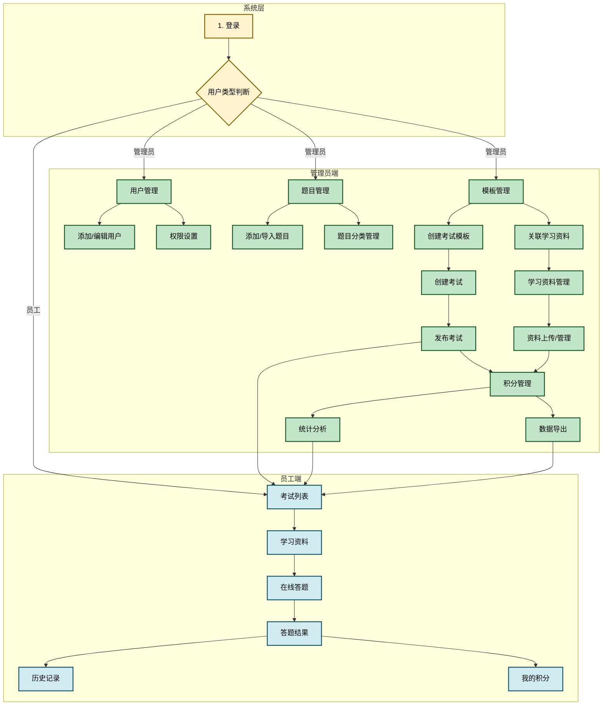

# 国网后勤考试系统需求文档

## 文档信息

| 项目 | 内容 |
|------|------|
| 文档名称 | 国网后勤考试系统需求文档 |
| 版本号 | V1.0 |
| 创建日期 | 2026-03-23 |
| 适用范围 | 国网后勤考试系统开发 |

---

## 一、背景说明

### 1.1 项目背景

国网后勤考试系统是为了满足国家电网公司后勤部门员工培训与考核需求而开发的一套综合性在线考试管理平台。该系统旨在通过信息化手段，提升后勤员工的安全知识水平、业务能力和综合素质，实现培训考核工作的规范化、智能化管理。

随着国网公司业务的快速发展，对后勤员工的专业技能和安全意识提出了更高要求。传统的纸质考试方式存在效率低、统计困难、反馈滞后等问题，无法满足现代化管理的需求。因此，建设一套功能完善、操作便捷、数据安全的在线考试系统具有重要的现实意义。

### 1.2 建设目标

本系统的建设目标包括以下几个方面：

**1. 实现考试管理的全流程信息化**
通过系统化的题库管理、考试创建、在线答题、自动评分等功能，实现从出题到成绩统计的全流程管理，大幅提升工作效率。

**2. 建立完善的学习资料管理体系**
在员工参加考试前，可以通过系统学习相关的培训资料，包括PDF文档、视频教程等多种格式，确保员工具备必要的知识储备。

**3. 构建积分激励体系**
通过积分奖励机制，激励员工积极参与学习和考试，形成正向的学习动力，提升整体培训效果。

**4. 提供全面的数据统计分析**
系统能够对考试数据、员工表现、错题分布等进行多维度分析，为管理层提供决策支持。

### 1.3 用户范围

| 用户类型 | 角色描述 | 主要职责 |
|----------|----------|----------|
| 超级管理员 | 系统最高权限管理者 | 负责系统全局管理、权限分配、数据维护 |
| 普通管理员 | 考试和题库管理者 | 负责题库维护、考试创建、统计分析 |
| 员工 | 考试参与者 | 参加考试、学习资料、查看成绩 |

### 1.4 系统架构

系统采用前后端分离架构设计：

- **前端技术栈**：Vue 3 + Element Plus + ECharts
- **路由管理**：Vue Router
- **状态管理**：Pinia
- **部署方式**：支持PC端浏览器访问

---

## 二、业务流程

### 2.1 总体业务流程图



### 2.2 业务流程详细说明

#### 2.2.1 管理员端业务流程

**用户管理流程**

1. 管理员登录系统
2. 进入用户管理页面
3. 添加新用户（填写用户名、姓名、角色、部门、联系方式等信息）
4. 分配账号密码
5. 设置用户权限（超级管理员/普通管理员）
6. 用户信息维护（编辑、删除、重置密码）

**题目管理流程**

1. 进入题目管理页面
2. 选择题目管理方式：
   - 手动添加题目
   - 批量导入题目（支持Excel、CSV格式）
   - AI自动生成考题（不考虑）
3. 填写题目信息：
   - 选择题目类型（单选题、多选题、判断题）
   - 选择题目分类
   - 设置难度等级
   - 输入题目内容
   - 维护选项和正确答案
   - 添加答案解析
4. 题目分类管理
5. 题目查询和筛选

**考试模板管理流程**

1. 进入考试模板管理页面
2. 创建考试模板：
   - 填写模板名称和描述
   - 选择题目分类范围
   - 设置难度分布
   - 配置题目数量
   - 设置考试时长
   - 设定及格分数
   - 关联学习资料
   - 设置学习要求（是否必须完成学习才能参加考试）
3. 模板权限设置（可见部门、指定人员）
4. 查看模板下的考试列表
5. 模板维护（编辑、删除）

**考试管理流程**

1. 进入考试管理页面
2. 创建新考试：
   - 选择考试模板
   - 填写考试名称
   - 设置考试类型（正式考试/练习模式）
   - 设置开始时间和结束时间
   - 配置题目数量和分值
   - 从题库选择题目组成试卷
3. 考试发布后生成二维码和考试码
4. 考试监控和维护：
   - 查看考试详情
   - 查看参与统计（参与人数、通过率、平均分、最高分）
   - 编辑考试信息
   - 删除考试

**学习资料管理流程**

1. 进入学习资料管理页面
2. 上传学习资料（支持PDF、Word等格式）
3. 填写资料信息（标题、描述、分类、预计学习时长）
4. 将资料关联到考试模板
5. 设置学习要求
6. 资料维护（编辑、删除）

**积分管理流程**

1. 进入积分管理页面
2. 查看员工积分排名
3. 查看个人积分明细
4. 手动调整员工积分
5. 导出积分报表
6. 配置积分规则

**统计分析流程**

1. 进入统计分析页面
2. 查看核心指标：
   - 考试总数
   - 答题记录数
   - 平均分
   - 通过率
3. 查看数据可视化图表：
   - 部门答题情况对比（柱状图+折线图）
   - 月度考试趋势（折线图）
   - 错题分布TOP10
4. 查看个人答题详情

**数据导出流程**

1. 进入数据导出页面
2. 选择导出类型：
   - 统计数据（按日期范围筛选）
   - 答题记录（按考试筛选）
   - 题目库（按分类筛选）
3. 执行导出操作
4. 查看导出历史记录
5. 下载导出文件

#### 2.2.2 员工端业务流程

**登录流程**

1. 打开系统登录页面
2. 输入工号/用户名和密码
3. 系统验证身份
4. 登录成功，根据角色进入相应页面

**考试列表流程**

1. 进入考试列表页面
2. 查看可参与的考试
3. 筛选考试（按状态：进行中/未开始）
4. 搜索考试名称
5. 查看考试详情（考试名称、时间、时长、题目数量、总分、及格分数）
6. 确认开始答题

**学习资料流程（前置条件）**

1. 进入学习资料页面
2. 查看需要学习的学习资料列表
3. 每个资料卡片显示关联的考试信息
4. 选择学习资料进行学习（支持PDF预览、图片查看、视频播放）
5. 标记资料为已学习
6. 查看学习进度

**在线答题流程**

1. 进入答题页面
2. 系统显示倒计时
3. 查看题目导航
4. 阅读题目并选择答案：
   - 单选题：选择一个选项
   - 多选题：选择多个选项
   - 判断题：判断对错
5. 标记疑难题目
6. 题目导航跳转（上一题、下一题、直接跳转）
7. 确认提交答案
8. 系统自动评分

**答题结果流程**

1. 查看本次考试成绩
2. 显示是否及格
3. 查看正确/错误题目统计
4. 查看答案解析
5. 选择重新答题或返回列表

**历史记录流程**

1. 进入历史记录页面
2. 查看历史答题记录
3. 筛选记录（按日期范围、按结果：通过/未通过）
4. 查看历史考试成绩详情
5. 查看历史错题本（全部错题/按考试分类）

**我的积分流程**

1. 进入我的积分页面
2. 查看当前积分
3. 查看积分获取记录
4. 查看积分排名

---

## 三、功能说明

### 3.1 管理端功能

#### 3.1.1 用户管理

**功能描述**

用户管理是系统的基础管理模块，用于管理系统管理员和普通管理员账号。

**功能详情**

| 功能项 | 功能描述 | 备注 |
|--------|----------|------|
| 登录管理 | 管理员登录管理端系统 | 需要验证用户名和密码 |
| 添加用户 | 添加新的后勤管理人员 | 填写用户名、姓名、角色、部门、联系电话、邮箱、初始密码 |
| 编辑用户 | 编辑现有管理人员信息 | 可修改除用户名外的所有信息 |
| 删除用户 | 删除管理人员账号 | 超级管理员不可删除 |
| 权限设置 | 设置管理人员权限 | 超级管理员/普通管理员 |
| 重置密码 | 重置管理人员密码 | 重置为默认密码 |

**界面要素**

- 用户列表表格（用户名、姓名、角色、部门、联系电话、邮箱、状态）
- 添加/编辑用户对话框
- 操作按钮（编辑、重置密码、删除）

#### 3.1.2 题目管理

**功能描述**

题目管理用于维护考试题库，支持多种题型和批量操作。

**功能详情**

| 功能项 | 功能描述 | 备注 |
|--------|----------|------|
| 题目导入 | 批量导入题目 | 支持Excel、CSV格式 |
| 下载模板 | 下载题目导入模板 | 提供标准导入格式 |
| 数据校验 | 导入数据校验和错误提示 | 验证格式和必填项 |
| 手动添加 | 手动添加新题目 | 支持单选题、多选题、判断题 |
| 编辑题目 | 编辑现有题目内容 | 修改题目、选项、答案 |
| 删除题目 | 删除题目 | 确认后从题库移除 |
| 分类管理 | 题目分类管理 | 添加、编辑、删除分类 |
| 难度设置 | 设置题目难度 | 简单、中等、困难 |
| 搜索筛选 | 题目搜索和筛选 | 按分类、类型、难度、关键词 |
| AI生成（不考虑） | AI自动生成考题 | 根据管理员指令生成题目 |

**题目类型**

- **单选题**：4个选项，单一正确答案
- **多选题**：2-6个选项，多个正确答案
- **判断题**：正确/错误

**题目属性**

| 属性 | 说明 |
|------|------|
| 题目类型 | 单选题、多选题、判断题 |
| 题目分类 | 安全生产法规、电气安全、高处作业、消防安全、应急处置、设备操作等 |
| 难度等级 | 简单、中等、困难 |
| 题目内容 | 题目正文 |
| 选项 | 各选项内容 |
| 正确答案 | 正确答案 |
| 答案解析 | 题目解析说明 |

**界面要素**

- 题目列表表格
- 添加/编辑题目对话框
- 导入题目对话框
- AI生成考题对话框
- 题目分类管理对话框

#### 3.1.3 考试模板管理

**功能描述**

考试模板是考试的基本框架，定义了考试的题目来源、难度分布和基本规则。

**功能详情**

| 功能项 | 功能描述 | 备注 |
|--------|----------|------|
| 创建模板 | 创建考试模板 | 设置模板名称、描述、题目分类、难度、数量、时长、及格分数 |
| 编辑模板 | 编辑和删除考试模板 | 修改模板配置 |
| 题目分类 | 为模板设置题目分类 | 从题库分类中选择 |
| 难度设置 | 设置题目难度分布 | 简单、中等、困难、混合 |
| 查看考试 | 查看模板下的考试列表 | 显示关联的考试 |
| 权限设置 | 模板权限设置 | 设置可见部门、指定人员 |
| 关联资料 | 关联学习资料到模板 | 关联后员工需先学习资料 |
| 学习要求 | 设置是否必须完成学习 | 强制学习/不强制 |
| 上传模板 | 上传考试模板文件 | 支持Excel格式 |
| AI生成 | AI生成考试模板 | 根据指令自动生成 |

**模板属性**

| 属性 | 说明 |
|------|------|
| 模板名称 | 模板的名称标识 |
| 模板描述 | 模板的详细说明 |
| 题目分类 | 包含的题目分类 |
| 难度设置 | 题目难度分布 |
| 题目数量 | 生成的题目数量 |
| 考试时长 | 默认考试时长（分钟） |
| 及格分数 | 及格分数线 |
| 关联资料 | 关联的学习资料 |
| 学习要求 | 是否必须完成学习 |

**界面要素**

- 考试模板列表
- 创建/编辑模板对话框
- 考试列表对话框
- 权限设置对话框
- AI生成模板对话框

#### 3.1.4 考试管理

**功能描述**

考试管理用于创建、发布和维护具体考试。

**功能详情**

| 功能项 | 功能描述 | 备注 |
|--------|----------|------|
| 创建考试 | 创建新考试/练习 | 基于模板创建 |
| 考试名称 | 设置考试名称 | 自定义名称 |
| 考试时间 | 设置开始/结束时间 | 日期时间选择 |
| 题目配置 | 设置题目数量和分值 | 自定义配置 |
| 及格分数 | 设置及格分数线 | 自定义分数 |
| 选择题目 | 从题库中选择题目 | 支持分类、类型、难度筛选 |
| 编辑考试 | 编辑和删除考试 | 修改考试配置 |
| 考试详情 | 查看考试详情 | 显示考试信息和参与统计 |
| 二维码 | 生成考试二维码 | 支持扫码参与 |
| 考试码 | 生成考试码 | 便捷的考试标识 |
| 参与统计 | 查看参与统计 | 参与人数、通过率、平均分、最高分 |

**考试类型**

- **正式考试**：计时考试，计入成绩统计
- **练习模式**：不计时间，可重复练习

**考试状态**

- **未开始**：考试时间未到
- **进行中**：考试开放中
- **已结束**：考试时间已过

**界面要素**

- 考试列表表格
- 创建/编辑考试对话框
- 题目选择对话框
- 考试详情对话框
- 考试二维码对话框

#### 3.1.5 学习资料管理

**功能描述**

学习资料管理用于上传和管理培训学习资料。

**功能详情**

| 功能项 | 功能描述 | 备注 |
|--------|----------|------|
| 资料上传 | 上传学习资料 | 支持PDF、Word、图片、视频 |
| 资料编辑 | 编辑资料标题和描述 | 修改基本信息 |
| 删除资料 | 删除学习资料 | 确认后删除 |
| 资料列表 | 查看学习资料列表 | 显示所有资料 |
| 关联模板 | 将资料关联到考试模板 | 建立资料与考试关联 |
| 分类管理 | 资料分类管理 | 按分类组织资料 |

**资料类型**

| 类型 | 说明 | 支持格式 |
|------|------|----------|
| PDF文档 | 文字资料 | .pdf |
| 视频教程 | 视频资料 | .mp4, .avi |
| 图片资料 | 图片说明 | .jpg, .png |
| Word文档 | 文档资料 | .doc, .docx |

**界面要素**

- 学习资料列表
- 上传资料对话框
- 资料详情预览

#### 3.1.6 积分管理

**功能描述**

积分管理用于查看和管理员工积分。

**功能详情**

| 功能项 | 功能描述 | 备注 |
|--------|----------|------|
| 积分排名 | 查看员工积分排名 | 按积分高低排序 |
| 积分明细 | 查看个人积分明细 | 查看积分获取记录 |
| 手动调整 | 手动调整员工积分 | 增加/减少积分 |
| 报表导出 | 导出积分报表 | 导出为Excel |
| 规则配置 | 积分规则配置 | 可自定义各项积分奖励 |

**积分规则**

| 行为 | 积分奖励 |
|------|----------|
| 完成单篇学习资料 | +10积分 |
| 完成全部关联资料学习 | +20积分 |
| 考试及格 | +30积分 |
| 考试不及格 | +10积分（参与奖） |
| 考试满分 | +50积分 |
| 连续学习7天 | +50积分 |
| 连续学习30天 | +200积分 |

**界面要素**

- 积分排行榜
- 积分明细列表
- 积分调整对话框

#### 3.1.7 统计分析

**功能描述**

统计分析用于展示考试相关数据的统计和分析结果。

**功能详情**

| 功能项 | 功能描述 | 备注 |
|--------|----------|------|
| 数据概览 | 查看核心指标 | 考试总数、答题记录、平均分、通过率 |
| 部门对比 | 查看部门答题情况 | 柱状图展示 |
| 趋势分析 | 月度考试趋势 | 折线图展示 |
| 错题分布 | 查看错题情况 | TOP10错题统计 |
| 个人详情 | 查看个人答题详情 | 选择员工查看 |

**统计指标**

| 指标 | 说明 |
|------|------|
| 考试总数 | 系统中创建的考试数量 |
| 答题记录 | 员工的答题总次数 |
| 平均分 | 所有考试的平均分数 |
| 通过率 | 考试及格的比例 |

**可视化图表**

- 部门答题情况对比柱状图+折线图
- 月度考试趋势折线图
- 错题分布表格

**界面要素**

- 统计概览卡片
- 部门对比图表
- 月度趋势图表
- 错题分布表格
- 个人答题详情表格

#### 3.1.8 数据导出

**功能描述**

数据导出用于将系统数据导出为标准格式文件。

**功能详情**

| 功能项 | 功能描述 | 备注 |
|--------|----------|------|
| 导出统计 | 导出统计数据 | 支持按日期范围筛选 |
| 导出记录 | 导出员工答题记录 | 支持按考试筛选 |
| 导出题库 | 导出题目库 | 支持按分类筛选 |
| 导出历史 | 查看导出历史记录 | 包含导出时间、操作人、数据量 |
| 文件下载 | 下载导出的文件 | 支持重新下载 |

**导出格式**

- Excel格式（.xlsx）
- CSV格式（.csv）

**界面要素**

- 导出功能卡片（三种类型）
- 日期选择器
- 考试选择器
- 分类选择器
- 导出历史表格

---

### 3.2 员工端功能

#### 3.2.1 用户登录

**功能描述**

员工登录系统，参加考试和查看成绩。

**功能详情**

| 功能项 | 功能描述 | 备注 |
|--------|----------|------|
| 账号登录 | 通过工号/账号登录 | 输入用户名和密码 |
| 记住状态 | 记住登录状态 | 保持会话 |
| 权限验证 | 验证用户身份 | 根据角色跳转 |

**界面要素**

- 登录表单（用户名、密码）
- 登录按钮
- 记住我复选框

#### 3.2.2 考试列表

**功能描述**

展示可参与的考试列表，供员工选择。

**功能详情**

| 功能项 | 功能描述 | 备注 |
|--------|----------|------|
| 考试列表 | 查看可参与的考试/练习 | 显示进行中和未开始的考试 |
| 考试详情 | 查看考试详情 | 名称、时间、分值等 |
| 筛选考试 | 按状态筛选 | 进行中/未开始 |
| 搜索考试 | 搜索考试名称 | 关键词搜索 |
| 开始答题 | 进入考试页面 | 确认后开始 |

**考试卡片信息**

- 考试名称
- 考试状态（进行中/未开始）
- 考试时长
- 题目数量
- 总分
- 及格分数
- 开始时间
- 结束时间

**界面要素**

- 考试列表（卡片式展示）
- 筛选下拉框
- 搜索框
- 考试详情对话框

#### 3.2.3 在线答题

**功能描述**

员工在考试界面进行答题。

**功能详情**

| 功能项 | 功能描述 | 备注 |
|--------|----------|------|
| 考试计时 | 考试时间倒计时 | 实时显示剩余时间 |
| 题目展示 | 显示题目和选项 | 支持多种题型 |
| 答题记录 | 记录用户答案 | 自动保存 |
| 题目导航 | 题目快速跳转 | 上一题、下一题、直接跳转 |
| 标记题目 | 标记疑难题目 | 便于复查 |
| 答案提交 | 提交答案 | 确认后提交 |

**答题功能**

- 支持单选题、多选题、判断题
- 实时显示答题进度
- 题目标记功能
- 倒计时提醒
- 自动提交（时间到）

**界面要素**

- 考试计时器
- 题目导航栏
- 题目内容区域
- 选项列表
- 标记按钮
- 上下题按钮
- 提交按钮

#### 3.2.4 答题结果

**功能描述**

展示考试完成后的成绩和答题详情。

**功能详情**

| 功能项 | 功能描述 | 备注 |
|--------|----------|------|
| 成绩展示 | 显示本次考试得分 | 分数和是否及格 |
| 统计信息 | 显示正确/错误数量 | 正确数、错误数、总题数 |
| 答题详情 | 查看每题答题情况 | 全部/正确/错误 |
| 答案解析 | 查看题目解析 | 显示正确答案和解析 |
| 重新答题 | 重新作答 | 返回重新考试 |

**结果显示**

- 成绩分数
- 及格/不及格状态
- 正确题数
- 错误题数
- 总题数

**界面要素**

- 成绩展示区
- 统计卡片
- 题目列表
- 答案解析
- 重新答题按钮
- 返回列表按钮

#### 3.2.5 历史记录

**功能描述**

查看历史考试记录和错题。

**功能详情**

| 功能项 | 功能描述 | 备注 |
|--------|----------|------|
| 答题记录 | 查看历史答题记录 | 按时间排序 |
| 成绩查看 | 查看历史考试成绩 | 显示各次考试分数 |
| 记录筛选 | 按时间筛选 | 日期范围筛选 |
| 结果筛选 | 按结果筛选 | 通过/未通过 |
| 错题本 | 查看历史错题 | 全部错题/按考试分类 |
| 详情查看 | 查看答题详情 | 查看历史考试详情 |

**历史记录字段**

- 考试名称
- 得分
- 考试结果（通过/未通过）
- 正确数
- 错误数
- 用时
- 提交时间

**界面要素**

- 历史记录表格
- 筛选工具栏
- 错题本区域
- 详情查看对话框

#### 3.2.6 学习资料

**功能描述**

员工查看和学习相关资料。

**功能详情**

| 功能项 | 功能描述 | 备注 |
|--------|----------|------|
| 资料列表 | 查看学习资料列表 | 按考试分组展示 |
| 考试关联 | 显示关联的考试 | 卡片显示"为《XXX考试》准备" |
| 资料学习 | 查看/播放资料 | PDF预览、图片查看、视频播放 |
| 学习进度 | 标记学习状态 | 未开始/学习中/已完成 |
| 进度追踪 | 显示学习进度 | 进度百分比 |
| 考试提醒 | 考试时间倒计时 | 即将开始的考试 |

**资料卡片信息**

- 资料标题
- 资料描述
- 资料类型（PDF/视频/文档）
- 关联考试名称
- 学习状态
- 学习进度
- 预计学习时长

**界面要素**

- 学习资料列表（卡片式）
- 资料预览区域
- 进度显示

#### 3.2.7 我的积分

**功能描述**

员工查看个人积分情况。

**功能详情**

| 功能项 | 功能描述 | 备注 |
|--------|----------|------|
| 当前积分 | 查看当前积分 | 实时积分显示 |
| 积分记录 | 查看积分获取记录 | 记录来源和时间 |
| 积分排名 | 查看积分排名 | 排名位置 |

**积分信息**

- 当前可用积分
- 历史累计积分
- 连续学习天数
- 积分获取记录

**界面要素**

- 积分展示卡片
- 积分记录列表
- 排名信息

---

## 四、数据模型

### 4.1 用户模型

```javascript
{
  id: Number,              // 用户ID
  username: String,         // 用户名
  password: String,         // 密码
  name: String,            // 姓名
  role: String,            // 角色 (super_admin/admin/employee)
  department: String,       // 部门
  phone: String,           // 联系电话
  email: String,           // 邮箱
  status: String,          // 状态 (active/inactive)
  employeeId: String,      // 工号（员工）
  points: Number,          // 当前积分
  totalPoints: Number,     // 历史累计积分
  learningDays: Number,    // 连续学习天数
  lastLearnDate: String    // 最后学习日期
}
```

### 4.2 题目模型

```javascript
{
  id: Number,              // 题目ID
  type: String,           // 题目类型 (single/multiple/judge)
  category: Number,       // 题目分类ID
  difficulty: String,     // 难度 (easy/medium/hard)
  content: String,        // 题目内容
  options: Array,          // 选项数组
  answer: String,         // 正确答案
  analysis: String,       // 答案解析
  createTime: String      // 创建时间
}
```

### 4.3 考试模板模型

```javascript
{
  id: Number,              // 模板ID
  name: String,           // 模板名称
  description: String,    // 模板描述
  categories: Array,      // 题目分类数组
  difficulty: String,    // 难度设置
  questionCount: Number, // 题目数量
  passScore: Number,     // 及格分数
  duration: Number,      // 考试时长（分钟）
  materials: Array,      // 关联学习资料ID数组
  requiredLearning: Boolean, // 是否强制学习
  createTime: String,    // 创建时间
  creator: String        // 创建人
}
```

### 4.4 考试模型

```javascript
{
  id: Number,              // 考试ID
  name: String,           // 考试名称
  templateId: Number,     // 模板ID
  type: String,          // 考试类型 (exam/practice)
  status: String,        // 状态 (upcoming/ongoing/ended)
  startTime: String,     // 开始时间
  endTime: String,       // 结束时间
  duration: Number,      // 考试时长
  totalScore: Number,    // 总分
  passScore: Number,     // 及格分数
  questionCount: Number, // 题目数量
  questions: Array,      // 题目ID数组
  creator: String,       // 创建人
  createTime: String,    // 创建时间
  qrcode: String         // 考试二维码
}
```

### 4.5 答题记录模型

```javascript
{
  id: Number,              // 记录ID
  examId: Number,         // 考试ID
  userId: Number,         // 用户ID
  userName: String,      // 用户姓名
  department: String,     // 部门
  answers: Object,       // 答案对象 {题目ID: 答案}
  score: Number,         // 得分
  isPass: Boolean,       // 是否及格
  correctCount: Number,  // 正确题数
  wrongCount: Number,    // 错误题数
  duration: Number,      // 用时（分钟）
  submitTime: String     // 提交时间
}
```

### 4.6 学习资料模型

```javascript
{
  id: Number,              // 资料ID
  title: String,          // 资料标题
  description: String,    // 资料描述
  type: String,          // 资料类型 (pdf/video/image/doc)
  url: String,           // 资料存储路径
  category: Number,      // 分类ID
  fileSize: Number,      // 文件大小
  duration: Number,      // 预计学习时长（分钟）
  createTime: String,    // 创建时间
  creator: String        // 创建人
}
```

### 4.7 积分记录模型

```javascript
{
  id: Number,              // 记录ID
  userId: Number,          // 用户ID
  type: String,           // 积分类型 (study/exam)
  action: String,         // 具体行为
  points: Number,          // 积分值
  description: String,    // 描述
  createTime: String      // 创建时间
}
```

---

## 五、非功能性需求

### 5.1 性能需求

| 指标 | 要求 |
|------|------|
| 页面加载时间 | ≤3秒 |
| 考试提交响应 | ≤2秒 |
| 并发用户数 | ≥100人 |
| 系统可用性 | ≥99.9% |

### 5.2 安全需求

- 用户密码加密存储
- 登录验证和会话管理
- 权限控制和访问限制
- 数据传输加密
- 考试防作弊机制

### 5.3 兼容性需求

- 支持主流浏览器（Chrome、Edge、Firefox、Safari）
- 响应式布局，支持不同屏幕尺寸
- 适配PC端使用

---

## 六、附录

### 6.1 题目分类参考

| 分类ID | 分类名称 | 说明 |
|--------|----------|------|
| 1 | 安全生产法规 | 国家安全生产相关法律法规 |
| 2 | 电气安全 | 电气作业安全规范 |
| 3 | 高处作业 | 高处作业安全规范 |
| 4 | 消防安全 | 消防安全知识 |
| 5 | 应急处置 | 突发事件应急处置 |
| 6 | 设备操作 | 电力设备操作规范 |

### 6.2 部门参考

| 部门名称 |
|----------|
| 运维部 |
| 检修部 |
| 安全部 |
| 培训部 |
| 信息部 |

---

## 文档版本历史

| 版本 | 日期 | 修改内容 | 作者 |
|------|------|----------|------|
| V1.0 | 2026-03-23 | 初始版本 | 系统分析 |
| V1.1 | 2026-03-23 | 更新业务流程图为Mermaid格式 | 系统分析 |

---

> 本文档为国网后勤考试系统需求文档，涵盖系统背景、业务流程和功能说明等内容。
