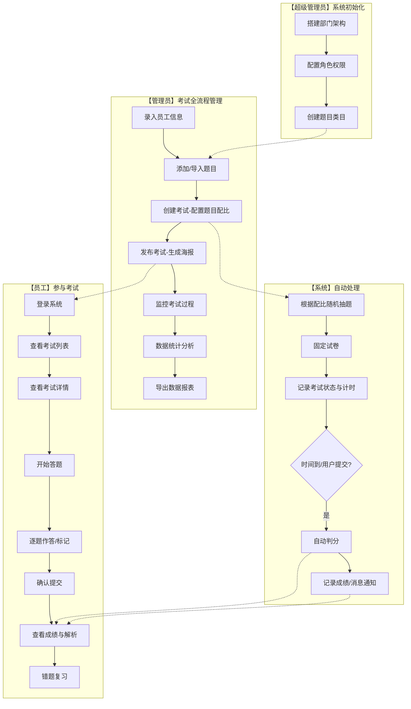
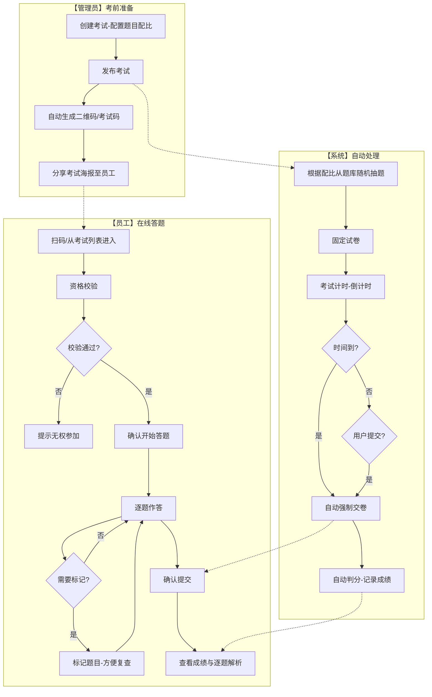

# 国网后勤考试管理系统 系统需求说明书

> **文档说明**：本文档为国网后勤考试管理系统的系统需求说明书，基于实际项目代码和业务需求编写，涵盖管理端（PC Web）和小程序端（H5）两大门户的全部功能模块。

---

## 文档信息

| 项目 | 内容 |
|------|------|
| 文档名称 | 国网后勤考试管理系统 系统需求说明书 |
| 项目名称 | 国网后勤考试管理系统 |
| 版本号 | V1.1 |
| 创建日期 | 2026-05-15 |
| 最后修订日期 | 2026-05-15 |
| 文档状态 | 修订中 |
| 密级 | 内部公开 |
| 编写人 | [姓名] |
| 审核人 | [姓名] |
| 批准人 | [姓名] |

---

## 修订历史

| 版本 | 日期 | 修订内容 | 修订人 | 审核人 |
|------|------|----------|--------|--------|
| V1.0 | 2026-05-15 | 初始版本 | [姓名] | [姓名] |

---

## 目次

- [1. 引言](#1-引言)
- [2. 项目概述](#2-项目概述)
- [3. 用户角色与使用场景](#3-用户角色与使用场景)
- [4. 功能需求](#4-功能需求)
- [5. 非功能需求](#5-非功能需求)
- [6. 数据需求](#6-数据需求)
- [7. 接口需求](#7-接口需求)
- [8. 约束与假设](#8-约束与假设)
- [9. 附录](#9-附录)

---

## 1. 引言

### 1.1 编写目的

本文档旨在明确国网后勤考试管理系统的系统需求，为后续的系统设计、开发实现、测试验证和项目验收提供依据。本文档的预期读者包括：

- **产品经理**：确认业务需求的完整性和准确性
- **系统分析师**：作为需求分析的输出和设计阶段的输入
- **开发工程师**：了解功能需求和非功能需求，指导编码实现
- **测试工程师**：根据需求编写测试用例，验证系统功能
- **项目管理人员**：评估工作量、制定项目计划
- **客户/用户代表**：确认系统功能满足业务需求

### 1.2 适用范围

本文档适用于国网后勤考试管理系统的需求分析阶段，涵盖管理端（PC Web）和小程序端（H5）两大门户的全部功能模块。本文档是后续概要设计、详细设计和编码实现的基础输入文档。

### 1.3 术语与缩略语

| 术语/缩略语 | 全称 | 说明 |
|-------------|------|------|
| SRS | Software Requirements Specification | 软件需求规格说明 |
| CRUD | Create, Read, Update, Delete | 增、删、改、查四种基本操作 |
| RBAC | Role-Based Access Control | 基于角色的访问控制 |
| PC Web | Personal Computer Web | 管理端PC浏览器访问方式 |
| H5 | HTML5 | 员工端移动端网页访问方式 |
| Mock Data | 模拟数据 | 用于开发和测试的模拟业务数据 |
| 管理端 | Admin Portal | 面向管理员的PC端管理系统 |
| 小程序端 | Employee Portal | 面向员工的小程序/H5端系统 |
| ECharts | Enterprise Charts | 基于JavaScript的数据可视化图表库 |
| Pinia | - | Vue 3 状态管理库 |
| Element Plus | - | 基于 Vue 3 的桌面端UI组件库 |

### 1.4 参考资料

| 序号 | 资料名称 | 版本 | 作者/来源 | 日期 |
|------|----------|------|-----------|------|
| 1 | 国网后勤考试系统需求文档 | V1.0 | 系统分析 | 2026-03-23 |
| 2 | 国网后勤考试管理系统项目设计说明 | V1.0 | 系统分析 | 2026-03-23 |
| 3 | 20260513需求变更说明 | V1.0 | 产品 | 2026-05-13 |
| 4 | 功能变更说明 | V1.0 | 产品 | 2026-05-13 |

---

## 2. 项目概述

### 2.1 项目背景

国网后勤考试管理系统是面向国家电网公司后勤部门员工培训与考核需求而开发的一套综合性在线考试管理平台。系统旨在通过信息化手段，提升后勤员工的安全知识水平、业务能力和综合素质，实现培训考核工作的规范化、智能化管理。

**业务现状**：

当前国网后勤部门的培训考核主要依赖传统纸质考试方式，存在以下问题：

- **效率低下**：出卷、印刷、分发、批改等环节耗时耗力
- **统计困难**：成绩汇总、数据分析依赖人工操作，易出错
- **反馈滞后**：考试结果反馈周期长，无法及时了解学习效果
- **资源浪费**：纸质试卷印刷造成大量资源消耗
- **管理不便**：题库管理、考试安排、历史记录查询缺乏统一平台

**建设目标**：

通过建设国网后勤考试管理系统，实现考试全流程信息化管理，提升培训考核工作效率。

### 2.3 系统范围

#### 2.3.1 系统边界

```
┌──────────────────────────────────────────────────┐
│                    国网后勤考试管理系统            │
│                                                    │
│  ┌───────────────┐       ┌───────────────────┐    │
│  │  管理端(PC Web) │       │  小程序端(H5)      │    │
│  │  - 系统管理     │       │  - 在线答题        │    │
│  │  - 题库管理     │       │  - 学习资料        │    │
│  │  - 考试管理     │       │  - 成绩查询        │    │
│  │  - 统计分析     │       │  - 积分查看        │    │
│  │  - 积分管理     │       │  - 消息通知        │    │
│  └───────┬───────┘       └────────┬──────────┘    │
│          │                        │                │
│          └──────────┬─────────────┘                │
│                     │                              │
│              ┌──────┴──────┐                       │
│              │  Mock数据层  │                       │
│              │ (当前实现)   │                       │
│              └─────────────┘                       │
└──────────────────────────────────────────────────┘
```

#### 2.3.2 开发范围

| 模块 | 功能概述 | 优先级 | 端 |
|------|----------|--------|------|
| 用户管理 | 用户CRUD、部门管理、角色权限管理、批量导入用户 | P1 | 管理端 |
| 题目管理 | 题目CRUD、分类管理、批量导入导出、AI生成考题 | P1 | 管理端 |
| 学习资料管理 | 资料上传/编辑/删除、分类管理、关联考试 | P1 | 管理端 |
| 考试管理 | 考试CRUD、发布/暂停/重启、二维码海报生成、题目配比 | P1 | 管理端 |
| 统计分析 | 数据概览、部门对比、月度趋势、成绩统计、错题分析、个人详情 | P1 | 管理端 |
| 积分管理 | 积分排行、规则配置、明细查询、手动调整 | P1 | 管理端 |
| 数据导出 | 统计数据/答题记录/题目库导出为Excel | P2 | 管理端 |
| 个人中心（管理端） | 个人信息编辑、密码修改 | P2 | 管理端 |
| 考试列表 | 查看可参与考试、筛选搜索 | P1 | 小程序端 |
| 在线答题 | 逐题作答、题目导航、标记、倒计时、自动判分 | P1 | 小程序端 |
| PC答题 | PC端独立答题页面（含独立登录流程） | P1 | 小程序端 |
| 考试结果 | 成绩展示、逐题解析、错题标记、重新答题 | P1 | 小程序端 |
| 历史记录 | 历史答题记录、错题本 | P1 | 小程序端 |
| 学习资料 | 资料学习、学习进度追踪 | P1 | 小程序端 |
| 我的积分 | 积分概览、排行、明细时间线 | P1 | 小程序端 |
| 个人中心（员工端） | 信息展示、统计卡片、编辑信息、密码修改 | P2 | 小程序端 |

#### 2.3.3 排除范围

以下功能在当前版本中不涉及：

1. **真实后端API对接** — 当前使用Mock数据模拟，后续需对接真实后端服务
2. **真实用户注册功能** — 用户由管理员在管理端创建
3. **考试防作弊机制（切屏检测、随机选项顺序）** — 需客户端能力支持
4. **多设备同时登录控制** — 当前未实现
5. **数据自动备份机制** — 需后端支持
6. **消息通知外部推送** — 当前仅限站内信，未对接企业微信/钉钉推送

### 2.4 用户群体

| 用户类型 | 角色描述 | 用户特征 | 使用频率 | 技术能力 |
|----------|----------|----------|----------|----------|
| 超级管理员 | 系统最高权限管理者 | 信息部门管理人员，负责系统全局管理 | 每日 | 较高 |
| 普通管理员 | 考试和题库管理者 | 各业务部门管理人员，负责具体业务操作 | 每日/每周 | 中等 |
| 员工 | 考试参与者 | 一线后勤员工，参加考试 | 按需（有考试时） | 一般 |

### 2.5 总体业务流程

> **说明**：以下泳道图按角色身份（超级管理员/管理员/系统/员工）划分泳道，仅展示一期开发范围的考试主业务流程。

#### 2.5.1 考试全生命周期泳道图



#### 2.5.2 答题核心流程泳道图



#### 2.5.3 积分获取流程泳道图

> **说明**：积分获取贯穿考试和学习全过程，自动在考试判分和学习完成时触发积分发放，管理员也可手动调整积分。

### 2.6 总体功能架构

| 门户 | 模块名称 | 功能点 | 功能描述 |
|------|----------|--------|----------|
| 管理端 | 登录模块 | 管理员登录 | 管理员登录系统，含角色校验 |
| 管理端 | 用户管理 | 用户管理 | 用户CRUD、密码重置、权限设置 |
| 管理端 | 用户管理 | 部门管理 | 部门CRUD、上级部门设置、负责人管理 |
| 管理端 | 用户管理 | 角色管理 | 角色CRUD、权限树分配 |
| 管理端 | 用户管理 | 批量导入 | Excel/CSV批量导入用户，含重复检测 |
| 管理端 | 题目管理 | 题目列表 | 题目CRUD、按分类/类型/难度筛选、关键词搜索 |
| 管理端 | 题目管理 | 题目导入 | Excel/CSV批量导入题目 |
| 管理端 | 题目管理 | 分类管理 | 题目分类CRUD |
| 管理端 | 题目管理 | AI生成考题 | 按分类/题型/数量自动生成考题 |
| 管理端 | 学习资料管理 | 资料列表 | 资料CRUD、按类型/分类筛选、名称搜索 |
| 管理端 | 学习资料管理 | 上传资料 | 拖拽上传PDF/视频/图片/文档 |
| 管理端 | 学习资料管理 | 分类管理 | 资料分类CRUD |
| 管理端 | 考试管理 | 考试列表 | 考试CRUD、状态管理（草稿/发布/暂停/重启） |
| 管理端 | 考试管理 | 创建考试 | 题目配比、时间设置、考试对象、学习要求 |
| 管理端 | 考试管理 | 发布海报 | Canvas绘制含二维码的推广海报 |
| 管理端 | 考试管理 | 考试详情 | 查看考试配置信息和参与统计数据 |
| 管理端 | 统计分析 | 答题概览 | ECharts图表展示核心指标、部门对比、月度趋势 |
| 管理端 | 统计分析 | 成绩统计 | 分数段分布饼图、TOP10排名 |
| 管理端 | 统计分析 | 错题分析 | 高频错题排行、错误率进度条 |
| 管理端 | 统计分析 | 部门统计 | 各维度部门答题指标、成绩趋势 |
| 管理端 | 统计分析 | 个人详情 | 个人成绩趋势图、历史答题记录 |
| 管理端 | 积分管理 | 积分排行 | 员工积分排名（前三名金银铜牌标记） |
| 管理端 | 积分管理 | 积分规则配置 | 各行为积分奖励值可视化配置 |
| 管理端 | 积分管理 | 积分明细 | 按员工和类型筛选积分记录 |
| 管理端 | 积分管理 | 手动调整 | 管理员手动增减员工积分 |
| 管理端 | 数据导出 | 统计数据导出 | 按日期范围导出统计报表 |
| 管理端 | 数据导出 | 答题记录导出 | 按考试筛选导出答题明细 |
| 管理端 | 数据导出 | 题目库导出 | 按分类筛选导出题库 |
| 管理端 | 个人中心 | 个人信息编辑 | 修改姓名、部门、电话、邮箱 |
| 管理端 | 个人中心 | 密码修改 | 修改登录密码 |
| 小程序端 | 登录模块 | 员工登录 | 手机号+短信验证码登录 |
| 小程序端 | 考试列表 | 考试卡片展示 | 卡片形式展示可参与的考试 |
| 小程序端 | 考试列表 | 状态筛选/搜索 | 按考试状态筛选、关键词搜索 |
| 小程序端 | 考试列表 | 考试详情查看 | 查看考试详细信息 |
| 小程序端 | 在线答题 | 逐题作答 | 支持单选/多选/判断三种题型 |
| 小程序端 | 在线答题 | 题目导航 | 题号网格展示，支持点击跳转 |
| 小程序端 | 在线答题 | 题目标记 | 标记疑难题目便于复查 |
| 小程序端 | 在线答题 | 倒计时 | 考试时长倒计时提醒 |
| 小程序端 | 在线答题 | 提交判分 | 提交答案后自动判分 |
| 小程序端 | PC端答题 | PC答题界面 | PC端独立答题页面，含独立登录流程 |
| 小程序端 | 考试结果 | 成绩展示 | 圆形得分组件展示得分和及格状态 |
| 小程序端 | 考试结果 | 正确/错误统计 | 显示正确数、错误数、总题数、用时 |
| 小程序端 | 考试结果 | 逐题解析 | 每题展示正确答案和答案解析 |
| 小程序端 | 考试结果 | 重新答题 | 重新参加考试（需允许重考） |
| 小程序端 | 历史记录 | 历史答题记录 | 表格展示历史考试记录 |
| 小程序端 | 历史记录 | 记录筛选 | 按时间范围、考试结果筛选 |
| 小程序端 | 历史记录 | 错题本 | 自动收集错题，可按考试分类查看 |
| 小程序端 | 学习资料 | 资料列表 | 按考试分组展示学习资料 |
| 小程序端 | 学习资料 | 资料学习 | PDF预览/视频播放/图片查看 |
| 小程序端 | 学习资料 | 进度追踪 | 学习进度百分比显示 |
| 小程序端 | 我的积分 | 积分概览 | 当前积分、累计积分、连续学习天数 |
| 小程序端 | 我的积分 | 积分排行 | TOP5排行榜，显示个人排名 |
| 小程序端 | 我的积分 | 积分记录 | 按类型筛选的时间线记录 |
| 小程序端 | 个人中心 | 信息展示 | 展示头像、姓名、所属部门 |
| 小程序端 | 个人中心 | 统计卡片 | 参与考试数、平均分、学习时长 |
| 小程序端 | 个人中心 | 个人信息编辑 | 修改姓名、手机号、邮箱 |
| 小程序端 | 个人中心 | 密码修改 | 修改登录密码 |

---

## 3. 用户角色与使用场景

### 3.1 用户角色定义

| 角色名称 | 角色说明 | 核心职责 | 对应功能模块 |
|----------|----------|----------|-------------|
| 超级管理员 | 系统最高权限管理者，拥有全部功能权限 | 系统初始化配置、全局管理、权限分配、数据维护 | 全部管理端模块 |
| 普通管理员 | 考试和题库的具体业务管理者 | 题库维护、考试创建、学习资料管理、积分管理、统计分析 | 用户管理（受限）、题目管理、学习资料管理、考试管理、积分管理、统计分析 |
| 员工 | 考试参与者和学习者 | 参加考试、学习资料、查看成绩、积分查询、错题复习 | 考试列表、在线答题、学习资料、历史记录、我的积分、个人中心 |

### 3.2 典型使用场景

#### 场景一：系统初始化与基础配置

| 项目 | 内容 |
|------|------|
| 场景描述 | 超级管理员在系统部署完成后，进行部门架构、角色权限和题目类目的初始化配置 |
| 参与角色 | 超级管理员 |
| 前置条件 | 系统首次部署完成，超级管理员账号已创建 |
| 后置条件 | 系统基础配置完成，可正常开展后续业务 |
| 触发事件 | 系统首次上线使用 |

**基本流程：**

```
步骤1：管理员访问系统地址 → 进入管理端登录页 → 使用初始账号登录
  ↓
步骤2：进入用户管理 → 部门管理Tab → 添加一级部门（运维部、检修部、安全部、培训部、信息部）
  ↓
步骤3：进入用户管理 → 角色管理Tab → 定义角色（超级管理员、普通管理员）
  ↓
步骤4：进入题目管理 → 分类管理 → 创建一级类目（安全生产法规、电气安全、高处作业、消防安全、应急处置、设备操作）
```

**备选流程/异常流程：**

| 场景 | 处理方式 |
|------|----------|
| 部门已有数据需修改 | 支持编辑部门名称、负责人、上级部门 |
| 分类需要层级结构 | 支持创建一级分类和子分类 |

#### 场景二：管理员创建并发布考试

| 项目 | 内容 |
|------|------|
| 场景描述 | 管理员完成题库准备后，创建考试、配置题目配比、设置考试对象，发布考试并生成推广海报 |
| 参与角色 | 超级管理员、普通管理员 |
| 前置条件 | 题库中有足够题目，员工已录入系统 |
| 后置条件 | 考试状态变为"进行中"，生成考试二维码/考试码，员工可扫码参加 |
| 触发事件 | 需要进行员工考核 |

**基本流程：**

```
步骤1：管理员进入考试管理 → 点击"创建考试"
  ↓
步骤2：填写基本信息（考试名称、类型（正式考试/练习模式）、开始/结束时间、考试时长）
  ↓
步骤3：配置题目配比（选择类目→选择题型→设置抽取数量→设置每题分值）
  ↓
步骤4：设置及格分数、考试对象（全员/指定部门/指定人员）
  ↓
步骤5：提交创建（状态：草稿）
  ↓
步骤6：在考试列表找到该考试 → 点击"发布"
  ↓
步骤7：系统根据配比从题库随机抽题固定试卷 → 状态变更为"进行中"
  ↓
步骤8：自动生成推广海报（Canvas绘制，含二维码）→ 弹出预览对话框
  ↓
步骤9：管理员下载海报PNG → 通过企业微信/钉钉分享给员工
```

**备选流程/异常流程：**

| 场景 | 处理方式 |
|------|----------|
| 某类目下题目不足 | 发布时校验题目池数量，若不满足配比要求，提示管理员补充题目 |
| 考试发布后发现问题 | 管理员可点击"暂停"按钮暂停考试，修复后"重启" |
| 需要创建类似考试 | 使用"复制"功能基于已有考试快速创建副本 |
| 考试已不需要 | 删除未开始的考试（进行中的考试不可删除） |

#### 场景三：员工扫码参加考试并答题

| 项目 | 内容 |
|------|------|
| 场景描述 | 员工收到管理员分享的考试海报后，扫码进入系统，完成资格校验后开始答题并提交 |
| 参与角色 | 员工 |
| 前置条件 | 考试已发布且处于有效期内，员工账号已创建 |
| 后置条件 | 员工提交答案，系统自动判分，生成考试记录并发放积分 |
| 触发事件 | 员工扫描考试海报二维码 |

**基本流程：**

```
步骤1：员工扫描考试二维码 → 进入员工端登录页
  ↓
步骤2：输入用户名和密码登录（首次使用需使用管理员分配的账号）
  ↓
步骤3：进入考试详情页 → 查看考试信息（名称、时间、时长、题量、总分、及格分）
  ↓
步骤4：系统检查参加资格（权限匹配、次数限制、必学资料完成情况）
  ↓
步骤5：点击"开始答题" → 确认弹窗 → 进入答题页面
  ↓
步骤6：逐题作答（单选点击选项、多选勾选、判断点击对错）
  ↓
步骤7：使用题目导航栏跳转 → 可标记疑难题目
  ↓
步骤8：所有题目完成后点击"提交" → 确认对话框（显示已答/未答/标记数）
  ↓
步骤9：确认提交 → 系统自动判分 → 跳转到考试结果页
```

**备选流程/异常流程：**

| 场景 | 处理方式 |
|------|----------|
| 有必学资料未完成 | 提示"请先完成学习资料" → 跳转学习资料页 |
| 无权参加该考试 | 提示"您无权参加该考试，请联系管理员" |
| 超过最大参加次数 | 提示"已达到最大参加次数" |
| 考试已结束 | 提示"考试已结束" |
| 时间到未提交 | 系统自动强制提交当前已答内容，正常判分 |
| 答题过程中断网 | 本地缓存答题记录（当前版本需手动刷新恢复） |

#### 场景四：员工查看考试结果与错题复习

| 项目 | 内容 |
|------|------|
| 场景描述 | 员工提交考试后查看成绩、逐题解析，之后在历史记录中复习错题 |
| 参与角色 | 员工 |
| 前置条件 | 已完成考试并提交 |
| 后置条件 | 员工知悉考试成绩和错题知识点 |
| 触发事件 | 考试提交完成自动跳转 |

**基本流程：**

```
步骤1：自动跳转到考试结果页 → 显示圆形得分组件（得分+及格状态）
  ↓
步骤2：查看统计数据（正确数/错误数/总题数/答题用时）
  ↓
步骤3：切换到答题详情 → 逐题查看用户答案/正确答案/答案解析
  ↓
步骤4：可按筛选条件查看：全部题目/正确题目/错误题目
  ↓
步骤5：返回考试列表或重新答题（若允许重考）
  ↓
步骤6：后续进入历史记录 → 错题本板块 → 查看所有历史错题
  ↓
步骤7：可按考试分类查看错题 → 复习正确答案和解析
```

#### 场景五：管理员查看统计分析

| 项目 | 内容 |
|------|------|
| 场景描述 | 管理员在考试结束后查看各项统计数据，了解整体考试情况和员工表现 |
| 参与角色 | 超级管理员、普通管理员 |
| 前置条件 | 有至少一场考试已有员工参与并提交 |
| 后置条件 | 管理员获得统计分析结果，可导出数据报表 |
| 触发事件 | 考试进行中或结束后需要了解数据 |

**基本流程：**

```
步骤1：管理员进入统计分析页面
  ↓
步骤2：答题概览Tab → 查看核心指标（考试总数、答题记录数、平均分、通过率）
  ↓
步骤3：查看部门答题情况对比柱状图、月度考试趋势折线图
  ↓
步骤4：切换到成绩统计Tab → 查看分数段分布饼图、TOP10排名
  ↓
步骤5：切换到错题分析Tab → 查看高频错题排行
  ↓
步骤6：切换到个人详情Tab → 选择员工查看个人成绩趋势
  ↓
步骤7：进入数据导出页面 → 选择导出类型（统计数据/答题记录/题目库）→ 导出Excel
```

### 3.3 异常与边界场景汇总

| 异常场景 | 处理方式 | 涉及模块 |
|----------|----------|----------|
| 管理员忘记密码 | 联系超级管理员重置密码 | 登录模块 |
| 员工忘记密码 | 联系管理员重置密码 | 登录模块 |
| 账号被禁用 | 登录提示"账号已被禁用，请联系管理员" | 登录模块 |
| 员工多设备同时登录 | 当前未实现互踢机制 | 在线答题 |
| 答题中途退出 | 再次进入考试自动恢复到上次进度（未提交情况下） | 在线答题 |
| 考试过程中超时 | 系统自动强制提交已答内容 | 在线答题 |
| 某类目下题目不足 | 发布时校验并提示管理员补充 | 考试管理 |
| 考试时间冲突 | 检测到同一批对象在同一时间段有其他考试（仅预警） | 考试管理 |
| 管理员误操作 | 关键操作（删除/暂停）需二次确认 | 所有管理模块 |

---

## 4. 功能需求

### 4.1 功能模块划分

| 编号 | 模块名称 | 功能说明 | 关联角色 | 端 | 优先级 |
|------|----------|----------|----------|------|--------|
| F-001 | 登录模块 | 管理端/员工端独立登录，角色校验 | 管理员、员工 | 管理端+小程序端 | P1 |
| F-002 | 用户管理 | 用户CRUD、部门管理、角色权限管理、批量导入用户 | 超级管理员 | 管理端 | P1 |
| F-003 | 题目管理 | 题目CRUD、分类管理、批量导入导出、AI生成考题 | 管理员 | 管理端 | P1 |
| F-004 | 学习资料管理 | 资料上传/编辑/删除、分类管理、关联考试 | 管理员 | 管理端 | P1 |
| F-005 | 考试管理 | 考试CRUD、发布/暂停/重启、海报生成、题目配比 | 管理员 | 管理端 | P1 |
| F-006 | 统计分析 | ECharts图表展示、多维度分析（5个Tab） | 管理员 | 管理端 | P1 |
| F-007 | 积分管理 | 积分排行、规则配置、明细查询、手动调整 | 管理员 | 管理端 | P1 |
| F-008 | 数据导出 | 统计数据/答题记录/题目库导出为Excel | 管理员 | 管理端 | P2 |
| F-009 | 个人中心（管理端） | 个人信息编辑、密码修改 | 管理员 | 管理端 | P2 |
| F-010 | 考试列表 | 卡片展示、筛选搜索、考试详情 | 员工 | 小程序端 | P1 |
| F-011 | 在线答题 | 逐题作答、导航、标记、倒计时、判分 | 员工 | 小程序端 | P1 |
| F-012 | PC端答题 | PC独立答题页面（含独立登录流程） | 员工 | 小程序端 | P1 |
| F-013 | 考试结果 | 成绩展示、逐题解析、重新答题 | 员工 | 小程序端 | P1 |
| F-014 | 历史记录 | 答题记录、错题本 | 员工 | 小程序端 | P1 |
| F-015 | 学习资料（员工端） | 资料学习、进度追踪 | 员工 | 小程序端 | P1 |
| F-016 | 我的积分 | 积分概览、排行、明细 | 员工 | 小程序端 | P1 |
| F-017 | 个人中心（员工端） | 信息展示、统计卡片、编辑信息、密码修改 | 员工 | 小程序端 | P2 |

### 4.2 管理端功能需求

#### 4.2.1 登录模块（F-001）

**功能概述**：

提供管理端独立的登录入口，支持管理员身份验证和角色校验。

**功能列表**：

| 编号 | 功能项 | 功能描述 | 输入/前置条件 | 输出/后置条件 | 优先级 |
|------|--------|----------|--------------|--------------|--------|
| F-001-01 | 管理员登录 | 管理员输入用户名和密码进行登录验证 | 用户名、密码 | 登录成功进入管理端首页，失败提示错误信息 | P1 |
| F-001-02 | 角色校验 | 验证登录用户角色是否为管理员（super_admin/admin） | 用户已登录 | 员工账号禁止登录管理端，提示"无权访问" | P1 |
| F-001-03 | 登录状态持久化 | 记住登录状态，页面刷新后自动恢复 | 用户已登录 | 刷新后保持登录态 | P1 |
| F-001-04 | 退出登录 | 清除登录状态，返回登录页 | 用户已登录 | 跳转至登录页 | P1 |

**业务规则**：

| 规则编号 | 规则描述 | 适用范围 |
|----------|----------|----------|
| R-001 | 用户名和密码验证基于Mock数据，正确则登录成功 | F-001-01 |
| R-002 | 员工账号（role=employee）登录管理端时拒绝访问 | F-001-02 |
| R-003 | 登录状态保存至localStorage，支持页面刷新后自动恢复 | F-001-03 |

**界面原型描述**：

管理端登录页位于 `/admin-login`，包含：
- 用户名输入框
- 密码输入框
- 登录按钮
- 员工端登录入口链接

#### 4.2.2 用户管理（F-002）

**功能概述**：

用户管理是系统的基础管理模块，用于管理用户账号、部门架构和角色权限。分为三个Tab页：用户管理、部门管理、角色管理。

**功能列表**：

| 编号 | 功能项 | 功能描述 | 输入/前置条件 | 输出/后置条件 | 优先级 |
|------|--------|----------|--------------|--------------|--------|
| F-002-01 | 用户列表 | 以表格形式展示所有用户，支持按角色、部门筛选和关键词搜索 | 管理员已登录 | 展示用户列表 | P1 |
| F-002-02 | 添加用户 | 添加新用户，填写用户名、姓名、角色、部门、电话、邮箱、密码 | 填写用户信息表单 | 系统创建新用户账号 | P1 |
| F-002-03 | 编辑用户 | 编辑现有用户信息 | 选择目标用户 | 更新用户信息 | P1 |
| F-002-04 | 删除用户 | 删除指定用户账号 | 选择目标用户 | 用户从系统中移除 | P1 |
| F-002-05 | 重置密码 | 将用户密码重置为默认密码（123456） | 选择目标用户 | 用户密码重置成功 | P1 |
| F-002-06 | 权限设置 | 设置用户角色（super_admin/admin） | 选择目标用户 | 用户角色更新 | P1 |
| F-002-07 | 部门列表 | 以树形或表格形式展示部门架构 | 管理员已登录 | 展示部门列表及成员数 | P1 |
| F-002-08 | 添加部门 | 添加新部门，填写名称、上级部门、负责人 | 填写部门信息 | 系统创建新部门 | P1 |
| F-002-09 | 编辑部门 | 编辑现有部门信息 | 选择目标部门 | 更新部门信息 | P1 |
| F-002-10 | 删除部门 | 删除指定部门 | 选择目标部门 | 部门从系统中移除 | P1 |
| F-002-11 | 角色列表 | 以表格形式展示角色列表 | 管理员已登录 | 展示角色及用户数 | P1 |
| F-002-12 | 添加角色 | 添加新角色，填写名称、代码、描述，分配权限树 | 填写角色信息、勾选权限 | 系统创建新角色 | P1 |
| F-002-13 | 编辑角色 | 编辑现有角色信息和权限 | 选择目标角色 | 更新角色信息 | P1 |
| F-002-14 | 删除角色 | 删除指定角色 | 选择目标角色 | 角色从系统中移除 | P1 |
| F-002-15 | 权限树分配 | 通过el-tree组件展示权限层级，支持勾选分配 | 选择角色 | 权限配置保存 | P1 |

**业务规则**：

| 规则编号 | 规则描述 | 适用范围 |
|----------|----------|----------|
| R-004 | 超级管理员（super_admin）不可被删除 | F-002-04 |
| R-005 | 用户名全局唯一，不可重复 | F-002-02 |
| R-006 | 权限树按模块划分：用户管理、考试管理、题目管理、统计分析，每个模块含查看/添加/编辑/删除等细粒度权限 | F-002-15 |

#### 4.2.3 题目管理（F-003）

**功能概述**：

题目管理用于维护考试题库，支持多种题型（单选题、多选题、判断题）和批量操作。

**功能列表**：

| 编号 | 功能项 | 功能描述 | 输入/前置条件 | 输出/后置条件 | 优先级 |
|------|--------|----------|--------------|--------------|--------|
| F-003-01 | 题目列表 | 以表格形式展示所有题目，支持按分类、类型、难度筛选和关键词搜索 | 管理员已登录 | 展示题目列表 | P1 |
| F-003-02 | 添加题目 | 手动添加新题目，选择题型后动态展示对应表单 | 填写题目信息（题型、分类、难度、内容、选项、答案、解析） | 系统创建新题目 | P1 |
| F-003-03 | 编辑题目 | 编辑现有题目信息 | 选择目标题目 | 更新题目信息 | P1 |
| F-003-04 | 删除题目 | 删除指定题目 | 选择目标题目 | 题目从题库中移除 | P1 |
| F-003-05 | 批量导入 | 通过Excel/CSV文件批量导入题目 | 选择导入文件，上传 | 题目批量入库，显示导入结果（成功/失败） | P1 |
| F-003-06 | 下载模板 | 下载标准格式的题目导入模板 | 管理员已登录 | 下载模板文件（CSV格式） | P1 |
| F-003-07 | 分类管理 | 管理题目分类，支持添加/编辑/删除 | 管理员已登录 | 分类列表更新 | P1 |

**题目类型定义**：

| 题型 | 选项数量 | 答案格式 | 说明 |
|------|----------|----------|------|
| 单选题（single） | 4个（A/B/C/D） | 单个字母（如"A"） | 四选一 |
| 多选题（multiple） | 2-6个 | 字母组合（如"ABC"） | 多选，需全部选对 |
| 判断题（judge） | 2个（正确/错误） | "A"或"B" | 二选一 |

**业务规则**：

| 规则编号 | 规则描述 | 适用范围 |
|----------|----------|----------|
| R-007 | 题目分类预设6个一级类目：安全生产法规、电气安全、高处作业、消防安全、应急处置、设备操作 | F-003-08 |
| R-008 | 难度等级分为三级：easy（简单）、medium（中等）、hard（困难） | F-003-01 |
| R-009 | 导入模板中的类目名称需与系统已存在的类目名称完全一致 | F-003-05 |
| R-010 | 支持增量导入，不会覆盖已有题目 | F-003-05 |

#### 4.2.4 学习资料管理（F-004）

**功能概述**：

学习资料管理用于上传和管理培训学习资料，分为资料管理和分类管理两个Tab页。

**功能列表**：

| 编号 | 功能项 | 功能描述 | 输入/前置条件 | 输出/后置条件 | 优先级 |
|------|--------|----------|--------------|--------------|--------|
| F-004-01 | 资料列表 | 以表格形式展示所有学习资料，支持按类型、分类筛选和名称搜索 | 管理员已登录 | 展示资料列表 | P1 |
| F-004-02 | 上传资料 | 上传学习资料文件，填写标题、描述、类型、分类、学习时长 | 选择文件、填写资料信息 | 资料入库 | P1 |
| F-004-03 | 编辑资料 | 编辑现有资料信息 | 选择目标资料 | 更新资料信息 | P1 |
| F-004-04 | 删除资料 | 删除指定资料 | 选择目标资料 | 资料从系统中移除 | P1 |
| F-004-05 | 资料预览 | 按类型展示不同预览（PDF预览区域、视频播放区域、图片预览） | 选择目标资料 | 预览弹窗展示 | P1 |
| F-004-06 | 分类管理 | 管理资料分类，支持添加/编辑/删除 | 管理员已登录 | 分类列表更新 | P1 |

**资料类型**：

| 类型 | 说明 | 支持格式 |
|------|------|----------|
| PDF | 文字资料 | .pdf |
| 视频 | 视频教程 | .mp4, .avi, .mov |
| 图片 | 图片说明 | .jpg, .jpeg, .png |
| 文档 | 文档资料 | .doc, .docx |

#### 4.2.5 考试管理（F-005）

**功能概述**：

考试管理用于创建、发布和维护具体考试，是系统的核心业务模块。

**功能列表**：

| 编号 | 功能项 | 功能描述 | 输入/前置条件 | 输出/后置条件 | 优先级 |
|------|--------|----------|--------------|--------------|--------|
| F-005-01 | 考试列表 | 以表格形式展示所有考试，含状态标签和操作按钮 | 管理员已登录 | 展示考试列表 | P1 |
| F-005-02 | 创建考试 | 创建新考试，配置基本信息、题目配比、考试对象 | 填写考试配置信息 | 考试创建成功（状态：草稿/未开始） | P1 |
| F-005-03 | 编辑考试 | 编辑现有考试信息 | 选择目标考试 | 更新考试配置 | P1 |
| F-005-04 | 删除考试 | 删除指定考试 | 选择目标考试 | 考试从系统中移除 | P1 |
| F-005-05 | 发布考试 | 发布考试，自动抽题固定试卷，生成推广海报 | 选择目标考试 | 考试状态变更为"进行中" | P1 |
| F-005-06 | 暂停考试 | 暂停进行中的考试 | 选择目标考试 | 考试状态变更为"暂停" | P1 |
| F-005-07 | 重启考试 | 重启暂停的考试 | 选择目标考试 | 考试状态恢复为"进行中" | P1 |
| F-005-08 | 复制考试 | 基于已有考试快速创建副本 | 选择目标考试 | 生成副本（状态：未开始） | P1 |
| F-005-09 | 生成海报 | 生成含二维码的考试推广海报图片 | 考试已发布 | 弹出海报预览，支持下载PNG | P1 |
| F-005-10 | 考试详情 | 查看考试配置信息和参与统计数据 | 选择目标考试 | 展示详情弹窗 | P1 |

**考试状态流转**：

```
未开始(upcoming) ───发布──→ 进行中(ongoing) ───暂停──→ 暂停(paused)
     ↑                        ↑                            │
     └──────────────── 重启 ──┴──────────── 重启 ──────────┘
                                                      │
                                                      ▼
     已结束(ended) ←──── 时间到 / 手动结束 ←─────────┘
```

**发布海报功能说明**：

- 使用Canvas绘制750×1200px的推广图片
- 顶部为国网绿主题配色，显示"国网后勤考试"标题
- 中部显示考试名称、考试时间、考试时长、题量、总分、及格分
- 使用QRCode库生成考试二维码嵌入图片
- 底部显示"国网后勤考试系统"品牌标识
- 管理员可下载PNG图片分享给员工

**业务规则**：

| 规则编号 | 规则描述 | 适用范围 |
|----------|----------|----------|
| R-013 | 发布考试时，系统根据题目配比从题库中随机抽取题目，固定试卷 | F-005-05 |
| R-014 | 已结束的考试不可再发布或重启 | F-005-05 |
| R-015 | 删除考试需要在考试未开始或已结束时进行 | F-005-04 |
| R-016 | 考试总分 = 各题型（题目数量 × 每题分值）之和 | F-005-02 |
| R-017 | 考试配比支持多行配置：不同类目 + 不同题型组合，自动汇总总题数和总分 | F-005-02 |

#### 4.2.6 统计分析（F-006）

**功能概述**：

统计分析用于展示考试相关数据的统计和分析结果，包含答题概览、成绩统计、错题分析和个人详情四个Tab页。

**功能列表**：

| 编号 | 功能项 | 功能描述 | 输入/前置条件 | 输出/后置条件 | 优先级 |
|------|--------|----------|--------------|--------------|--------|
| F-006-01 | 数据概览 | 展示核心指标卡片：考试总数、答题记录数、平均分、通过率 | 管理员已登录 | 展示统计概览 | P1 |
| F-006-02 | 部门对比 | 以柱状图展示各部门答题情况对比，叠加折线图展示通过率 | 管理员已登录 | ECharts柱状图+折线图 | P1 |
| F-006-03 | 月度趋势 | 以折线图展示月度考试趋势（考试次数、参与人数、平均分） | 管理员已登录 | ECharts折线图 | P1 |
| F-006-04 | 成绩统计 | 选择具体考试，查看分数段分布饼图和TOP10排名 | 选择目标考试 | ECharts饼图+排名表格 | P1 |
| F-006-05 | 错题分析 | 展示高频错题排行（错误率、错误次数） | 管理员已登录 | 错题排行表格+进度条 | P1 |
| F-006-06 | 个人详情 | 选择员工，查看个人成绩趋势折线图和历史答题记录表格 | 选择目标员工 | 折线图+表格 | P1 |

**统计指标**：

| 指标 | 说明 |
|------|------|
| 考试总数 | 系统中创建的考试总数量 |
| 答题记录数 | 员工答题总次数 |
| 平均分 | 所有考试的平均分数 |
| 通过率 | 考试及格的比例 |
| 优秀率 | 成绩优秀（≥90分）的比例 |
| 部门统计 | 各部门的参与人数、平均分、通过率 |
| 月度趋势 | 每月考试次数、参与人数、平均分变化 |

#### 4.2.7 积分管理（F-007）

**功能概述**：

积分管理用于查看和管理员工积分，包含积分排行、规则配置、积分明细和手动调整四个Tab页。

**功能列表**：

| 编号 | 功能项 | 功能描述 | 输入/前置条件 | 输出/后置条件 | 优先级 |
|------|--------|----------|--------------|--------------|--------|
| F-007-01 | 积分排行 | 展示所有员工的积分排名，前3名特殊标记（金银铜牌），支持查看个人明细 | 管理员已登录 | 展示排名列表 | P1 |
| F-007-02 | 积分规则配置 | 配置各行为对应的积分奖励值 | 填写规则配置表单 | 积分规则更新 | P1 |
| F-007-03 | 积分明细 | 按员工和类型筛选查看积分记录 | 选择员工和筛选条件 | 展示积分记录列表 | P1 |
| F-007-04 | 手动调整 | 管理员手动增减指定员工的积分 | 选择员工、输入调整值和原因 | 积分调整生效，记录写入明细 | P1 |

**积分规则**：

| 行为 | 默认积分 | 说明 |
|------|---------|------|
| 完成单篇学习资料 | +10积分 | 完成一篇资料学习 |
| 完成全部关联资料 | +20积分 | 完成某考试的所有关联资料（额外奖励） |
| 考试及格 | +30积分 | 考试分数 ≥ 及格分 |
| 考试不及格 | +10积分 | 参与鼓励奖 |
| 考试满分 | +50积分 | 获得满分（额外奖励） |
| 连续学习7天 | +50积分 | 连续7天都有学习记录 |
| 连续学习30天 | +200积分 | 连续30天都有学习记录 |

#### 4.2.8 数据导出（F-008）

**功能概述**：

数据导出用于将系统数据导出为Excel格式文件，支持统计数据、答题记录和题目库三种导出类型。

**功能列表**：

| 编号 | 功能项 | 功能描述 | 输入/前置条件 | 输出/后置条件 | 优先级 |
|------|--------|----------|--------------|--------------|--------|
| F-008-01 | 导出统计 | 按日期范围筛选并导出统计数据 | 选择日期范围 | 下载Excel统计报表 | P2 |
| F-008-02 | 导出记录 | 按考试筛选并导出员工答题记录 | 选择目标考试 | 下载Excel答题记录 | P2 |
| F-008-03 | 导出题库 | 按分类筛选并导出题目库 | 选择分类筛选条件 | 下载Excel题目库 | P2 |
| F-008-04 | 导出历史 | 查看导出历史记录（时间、操作人、数据量） | 管理员已登录 | 展示导出历史列表 | P3 |
| F-008-05 | 文件下载 | 从导出历史中重新下载已导出的文件 | 选择历史记录 | 下载文件 | P3 |

#### 4.2.9 个人中心（管理端）（F-009）

**功能概述**：

管理端个人中心用于管理员修改个人信息和密码。

**功能列表**：

| 编号 | 功能项 | 功能描述 | 输入/前置条件 | 输出/后置条件 | 优先级 |
|------|--------|----------|--------------|--------------|--------|
| F-009-01 | 个人信息编辑 | 修改管理员的姓名、电话、邮箱等信息 | 填写修改信息 | 更新个人信息 | P2 |
| F-009-02 | 密码修改 | 修改登录密码，需验证原密码 | 输入原密码、新密码、确认密码 | 密码更新成功 | P2 |

### 4.3 小程序端功能需求

#### 4.3.1 登录模块（F-001）

**功能概述**：

提供员工端独立的登录入口，采用手机号+短信验证码方式进行身份验证。

**功能列表**：

| 编号 | 功能项 | 功能描述 | 输入/前置条件 | 输出/后置条件 | 优先级 |
|------|--------|----------|--------------|--------------|--------|
| F-001-04 | 员工登录 | 员工输入手机号和短信验证码进行登录验证，默认验证码为1234 | 手机号、验证码 | 登录成功进入考试列表页，失败提示错误信息 | P1 |
| F-001-05 | 发送验证码 | 校验手机号格式后发送验证码，触发60秒倒计时 | 输入手机号 | 提示"验证码已发送"，按钮进入倒计时 | P1 |
| F-001-06 | 手机号校验 | 校验手机号格式是否符合11位手机号规则 | 输入手机号 | 格式错误时提示"请输入正确的手机号" | P1 |

**界面原型描述**：

员工端登录页位于 `/employee-login`，包含：
- 手机号输入框（最大11位）
- 短信验证码输入框（最大6位）+ 获取验证码按钮（60秒倒计时）
- 登录按钮
- 管理端登录入口链接

#### 4.3.2 考试列表（F-011）

**功能概述**：

展示可参与的考试列表，供员工选择和开始考试。

**功能列表**：

| 编号 | 功能项 | 功能描述 | 输入/前置条件 | 输出/后置条件 | 优先级 |
|------|--------|----------|--------------|--------------|--------|
| F-011-01 | 考试卡片展示 | 以卡片形式展示可参与的考试，自动过滤已结束的考试 | 员工已登录 | 展示考试卡片列表 | P1 |
| F-011-02 | 考试详情 | 点击考试卡片查看考试详细信息 | 选择目标考试 | 弹出详情对话框 | P1 |
| F-011-03 | 状态筛选 | 按考试状态筛选（进行中/未开始） | 选择筛选条件 | 更新考试列表 | P1 |
| F-011-04 | 搜索考试 | 按考试名称关键词搜索 | 输入搜索关键词 | 展示匹配结果 | P1 |
| F-011-05 | 开始答题 | 点击开始答题按钮，进入资格校验和答题流程 | 选择目标考试 | 校验通过后进入答题页 | P1 |

**考试卡片信息**：

| 信息项 | 说明 |
|--------|------|
| 考试名称 | 考试的名称标识 |
| 考试状态 | 进行中/未开始，带颜色标签 |
| 考试时长 | 考试总时长（分钟） |
| 题目数量 | 试卷包含的题目总数 |
| 总分 | 试卷的总分数 |
| 及格分数 | 及格分数线 |
| 开始时间 | 考试开始时间 |
| 结束时间 | 考试结束时间 |

#### 4.3.3 在线答题（F-012）

**功能概述**：

员工在考试界面进行在线答题，系统提供完整的答题工具和自动判分功能。

**功能列表**：

| 编号 | 功能项 | 功能描述 | 输入/前置条件 | 输出/后置条件 | 优先级 |
|------|--------|----------|--------------|--------------|--------|
| F-012-01 | 考试计时 | 显示倒计时，基于考试时长自动计时 | 开始答题 | 实时显示剩余时间，时间到自动提交 | P1 |
| F-012-02 | 题目展示 | 显示题目内容和选项，支持三种题型 | 进入答题页 | 展示当前题目 | P1 |
| F-012-03 | 单选作答 | 点击选项选中，再次点击切换（radio样式） | 用户点击选项 | 选项选中状态更新 | P1 |
| F-012-04 | 多选作答 | 点击选项选中/取消（checkbox样式） | 用户点击选项 | 选项选中状态更新 | P1 |
| F-012-05 | 判断作答 | 点击"正确"或"错误" | 用户点击选项 | 选项选中状态更新 | P1 |
| F-012-06 | 题目导航 | 显示所有题号，颜色标记状态（灰色未答/绿色已答/黄色标记） | 进入答题页 | 题号条展示 | P1 |
| F-012-07 | 题号跳转 | 点击题号直接跳转到对应题目 | 点击题号 | 切换到目标题目 | P1 |
| F-012-08 | 标记题目 | 标记/取消标记当前题目 | 点击标记按钮 | 题号标记状态切换 | P1 |
| F-012-09 | 上一题/下一题 | 顺序切换题目 | 点击按钮 | 切换到上一题/下一题 | P1 |
| F-012-10 | 提交答案 | 提交所有答案，显示确认对话框 | 点击提交按钮 | 弹出确认框（已答/未答/标记数） | P1 |
| F-012-11 | 自动判分 | 逐题对比用户答案与正确答案，计算得分 | 提交答案 | 计算得分和正确/错误数 | P1 |
| F-012-12 | 自动提交 | 倒计时归零时自动提交当前已答内容 | 时间到 | 强制提交 | P1 |

**判分逻辑**：

```
score = Math.round((correctCount / totalQuestions) * 100)
其中：
- 单选题：用户答案 === 正确答案 → 正确
- 多选题：用户答案排序后 === 正确答案排序后 → 正确
- 判断题：用户答案 === 正确答案 → 正确
```

**界面原型描述**：

答题页布局：
- 顶部：考试计时器（时:分:秒）
- 左侧/上方：题目导航栏（题号网格，颜色标记状态）
- 中部：题目内容区域（题目文字+选项列表）
- 底部：上一题/下一题/标记/提交按钮

#### 4.3.4 PC端答题（F-013）

**功能概述**：

PC端独立的答题页面，与小程序端答题逻辑一致，但针对PC大屏进行布局优化。通过 `/pc-exam/:id` 路由访问，无需登录即可进入。

**功能列表**：

| 编号 | 功能项 | 功能描述 | 输入/前置条件 | 输出/后置条件 | 优先级 |
|------|--------|----------|--------------|--------------|--------|
| F-013-01 | PC答题界面 | 提供PC端优化的答题界面，左导航+右内容布局 | 访问PC端答题链接 | 展示PC答题页 | P1 |
| F-013-02 | 答题功能 | 同在线答题（F-012）的全部功能 | 用户操作 | 同在线答题 | P1 |

**与在线答题的区别**：

| 项目 | 小程序端答题 | PC端答题 |
|------|-------------|----------|
| 布局 | 上下结构，导航在顶部 | 左右结构，导航在左侧 |
| 路由 | `/employee/exam/:id` | `/pc-exam/:id` |
| 登录要求 | 需登录 | 无需登录 |
| 适配屏幕 | 移动端优先 | PC端大屏优先 |

#### 4.3.5 考试结果（F-014）

**功能概述**：

展示考试完成后的成绩和答题详情，支持查看答案解析。

**功能列表**：

| 编号 | 功能项 | 功能描述 | 输入/前置条件 | 输出/后置条件 | 优先级 |
|------|--------|----------|--------------|--------------|--------|
| F-014-01 | 成绩展示 | 显示圆形得分组件，含得分和及格状态（及格绿色/不及格红色） | 考试判分完成 | 展示成绩 | P1 |
| F-014-02 | 统计信息 | 显示正确数、错误数、总题数、用时 | 考试判分完成 | 展示统计卡片 | P1 |
| F-014-03 | 答题详情 | 展示每题答题情况，可筛选（全部/正确/错误） | 考试判分完成 | 展示题目列表 | P1 |
| F-014-04 | 答案解析 | 每题显示用户答案（绿色底正确/红色底错误）、正确答案、解析 | 查看答题详情 | 展示答案解析 | P1 |
| F-014-05 | 重新答题 | 重新参加考试（需考试允许重考） | 点击重新答题 | 返回答题页 | P1 |
| F-014-06 | 返回列表 | 返回考试列表页 | 点击返回按钮 | 跳转至考试列表 | P1 |

#### 4.3.6 历史记录（F-015）

**功能概述**：

查看历史考试记录和错题，包含历史答题记录和错题本两个板块。

**功能列表**：

| 编号 | 功能项 | 功能描述 | 输入/前置条件 | 输出/后置条件 | 优先级 |
|------|--------|----------|--------------|--------------|--------|
| F-015-01 | 答题记录 | 以表格形式展示历史答题记录 | 员工已登录 | 展示历史记录列表 | P1 |
| F-015-02 | 时间筛选 | 按时间范围筛选历史记录 | 选择日期范围 | 更新记录列表 | P1 |
| F-015-03 | 结果筛选 | 按考试结果筛选（通过/未通过） | 选择筛选条件 | 更新记录列表 | P1 |
| F-015-04 | 详情查看 | 查看历史考试的成绩和答题详情 | 选择目标记录 | 跳转考试结果页 | P1 |
| F-015-05 | 错题本 | 自动收集所有历史考试的错题 | 员工已登录 | 展示错题列表 | P1 |
| F-015-06 | 错题分类 | 按考试分类查看错题 | 选择目标考试 | 展示该考试的全部错题 | P1 |
| F-015-07 | 错题复习 | 查看错题的正确答案和解析 | 选择目标错题 | 展示题目详情和解析 | P1 |

#### 4.3.7 学习资料（员工端）（F-015）

**功能概述**：

员工查看和学习相关资料，支持按考试维度分组展示，追踪学习进度。

**功能列表**：

| 编号 | 功能项 | 功能描述 | 输入/前置条件 | 输出/后置条件 | 优先级 |
|------|--------|----------|--------------|--------------|--------|
| F-015-01 | 资料列表 | 按考试维度分组展示学习资料 | 员工已登录 | 展示分组资料列表 | P1 |
| F-015-02 | 进度展示 | 每个考试组显示学习进度条（已完成数/总数） | 员工已登录 | 进度百分比显示 | P1 |
| F-015-03 | 资料卡片 | 展示资料标题、描述、类型标签（PDF/视频/图片）、学习状态 | 员工已登录 | 资料卡片展示 | P1 |
| F-015-04 | 资料预览 | 打开资料预览弹窗（PDF预览/视频播放/图片查看） | 点击资料卡片 | 预览弹窗 | P1 |
| F-015-05 | 完成学习 | 点击"完成学习"按钮，记录学习完成状态并发放积分 | 完成资料学习 | 状态标记为"已完成"，获得积分 | P1 |
| F-015-06 | 筛选 | 按考试和学习状态筛选资料 | 选择筛选条件 | 更新资料列表 | P1 |

**资料卡片信息**：

| 信息项 | 说明 |
|--------|------|
| 资料标题 | 资料的名称标识 |
| 资料描述 | 资料的简要说明 |
| 资料类型 | PDF/视频/图片（带类型标签） |
| 学习状态 | 未开始/学习中/已完成（带颜色标签） |
| 学习进度 | 学习中状态时显示百分比进度条 |
| 预计时长 | 预计学习时长（分钟） |

#### 4.3.8 我的积分（F-016）

**功能概述**：

员工查看个人积分情况，包含积分概览、积分排行和积分记录三个板块。

**功能列表**：

| 编号 | 功能项 | 功能描述 | 输入/前置条件 | 输出/后置条件 | 优先级 |
|------|--------|----------|--------------|--------------|--------|
| F-016-01 | 积分概览 | 渐变卡片展示当前积分、累计积分、连续学习天数 | 员工已登录 | 展示积分概览 | P1 |
| F-016-02 | 积分排行 | TOP5排行展示，前3名特殊标记（金银铜牌），显示个人排名 | 员工已登录 | 展示排行列表 | P1 |
| F-016-03 | 积分记录 | 按类型筛选（全部/学习/考试）的时间线记录 | 员工已登录 | 展示积分记录列表 | P1 |

#### 4.3.9 个人中心（员工端）（F-017）

**功能概述**：

员工端个人中心用于查看个人信息和统计数据，以及修改密码。

**功能列表**：

| 编号 | 功能项 | 功能描述 | 输入/前置条件 | 输出/后置条件 | 优先级 |
|------|--------|----------|--------------|--------------|--------|
| F-017-01 | 信息展示 | 渐变卡片展示头像、姓名、所属部门 | 员工已登录 | 展示个人信息 | P2 |
| F-017-02 | 统计卡片 | 展示统计：参与考试数、平均分、学习时长 | 员工已登录 | 展示统计卡片 | P2 |
| F-017-03 | 个人信息编辑 | 修改姓名、手机号、邮箱 | 填写修改信息 | 更新个人信息 | P2 |
| F-017-04 | 密码修改 | 修改登录密码（原密码→新密码→确认密码） | 输入密码 | 密码更新成功 | P2 |
| F-017-05 | 退出登录 | 清除登录状态，返回登录页 | 点击退出 | 跳转登录页 | P2 |

## 5. 数据需求

### 5.1 数据实体定义

> **说明**：以下实体为系统中所有数据模型的完整定义。

#### 5.1.1 用户（users）

**实体说明**：存储系统用户信息，包括管理员和员工。

| 字段名 | 数据类型 | 长度 | 必填 | 主键 | 外键 | 说明 |
|--------|----------|------|------|------|------|------|
| id | int | - | 是 | 是 | 否 | 用户ID，自增 |
| username | varchar | 50 | 是 | 否 | 否 | 登录用户名，全局唯一 |
| password | varchar | 100 | 是 | 否 | 否 | 登录密码 |
| name | varchar | 50 | 是 | 否 | 否 | 真实姓名 |
| role | varchar | 20 | 是 | 否 | 否 | 角色：super_admin/admin/employee |
| department | varchar | 50 | 是 | 否 | 否 | 所属部门名称 |
| phone | varchar | 20 | 否 | 否 | 否 | 联系电话 |
| email | varchar | 100 | 否 | 否 | 否 | 邮箱地址 |
| status | varchar | 10 | 是 | 否 | 否 | 状态：active/disabled |
| employeeId | varchar | 50 | 否 | 否 | 否 | 员工工号（仅员工角色） |
| points | int | - | 否 | 否 | 否 | 当前积分 |
| totalPoints | int | - | 否 | 否 | 否 | 历史累计积分 |
| learningDays | int | - | 否 | 否 | 否 | 连续学习天数 |
| lastLearnDate | date | - | 否 | 否 | 否 | 最后学习日期 |
| createTime | datetime | - | 是 | 否 | 否 | 创建时间 |

**业务约束**：
1. username 全局唯一
2. role 取值范围：super_admin / admin / employee
3. status 取值范围：active / disabled

#### 5.1.2 题目（questions）

**实体说明**：存储题库中的题目信息。

| 字段名 | 数据类型 | 长度 | 必填 | 主键 | 外键 | 说明 |
|--------|----------|------|------|------|------|------|
| id | int | - | 是 | 是 | 否 | 题目ID，自增 |
| type | varchar | 10 | 是 | 否 | 否 | 题型：single/multiple/judge |
| category | int | - | 是 | 否 | 是 | 分类ID，关联categories |
| difficulty | varchar | 10 | 是 | 否 | 否 | 难度：easy/medium/hard |
| content | text | - | 是 | 否 | 否 | 题目内容 |
| options | json | - | 是 | 否 | 否 | 选项数组（JSON格式） |
| answer | varchar | 10 | 是 | 否 | 否 | 正确答案 |
| analysis | text | - | 否 | 否 | 否 | 答案解析 |
| createTime | datetime | - | 是 | 否 | 否 | 创建时间 |

**业务约束**：
1. type 取值范围：single / multiple / judge
2. difficulty 取值范围：easy / medium / hard
3. 单选题（single）选项固定为4个
4. 判断题（judge）选项固定为["正确", "错误"]
5. 多选题（multiple）选项2-6个

#### 5.1.3 考试（exams）

**实体说明**：存储考试配置信息。

| 字段名 | 数据类型 | 长度 | 必填 | 主键 | 外键 | 说明 |
|--------|----------|------|------|------|------|------|
| id | int | - | 是 | 是 | 否 | 考试ID，自增 |
| name | varchar | 200 | 是 | 否 | 否 | 考试名称 |
| templateId | int | - | 否 | 否 | 是 | 关联模板ID |
| type | varchar | 10 | 是 | 否 | 否 | 考试类型：exam/practice |
| status | varchar | 10 | 是 | 否 | 否 | 状态：upcoming/ongoing/paused/ended |
| startTime | datetime | - | 是 | 否 | 否 | 开始时间 |
| endTime | datetime | - | 是 | 否 | 否 | 结束时间 |
| duration | int | - | 是 | 否 | 否 | 考试时长（分钟） |
| totalScore | int | - | 是 | 否 | 否 | 总分 |
| passScore | int | - | 是 | 否 | 否 | 及格分数 |
| questionCount | int | - | 是 | 否 | 否 | 题目数量 |
| questions | json | - | 是 | 否 | 否 | 题目ID数组 |
| creator | varchar | 50 | 是 | 否 | 否 | 创建人用户名 |
| createTime | datetime | - | 是 | 否 | 否 | 创建时间 |
| qrcode | varchar | 50 | 否 | 否 | 否 | 考试二维码标识/考试码 |
| examUrl | varchar | 500 | 否 | 否 | 否 | 考试访问链接 |
| targetType | varchar | 20 | 否 | 否 | 否 | 考试对象类型：all/department/user |
| maxAttempts | int | - | 否 | 否 | 否 | 最大参加次数，默认1次 |

**业务约束**：
1. status 取值范围：upcoming / ongoing / paused / ended
2. type 取值范围：exam（正式考试）/ practice（练习模式）
3. 状态流转：upcoming → ongoing → paused ↔ ongoing → ended

#### 5.1.4 考试模板（examTemplates）

**实体说明**：存储考试模板配置信息。模板为考试的基本框架，定义题目来源和基本规则。

| 字段名 | 数据类型 | 长度 | 必填 | 主键 | 外键 | 说明 |
|--------|----------|------|------|------|------|------|
| id | int | - | 是 | 是 | 否 | 模板ID，自增 |
| name | varchar | 200 | 是 | 否 | 否 | 模板名称 |
| description | text | - | 否 | 否 | 否 | 模板描述 |
| categories | json | - | 是 | 否 | 否 | 题目分类ID数组 |
| difficulty | varchar | 10 | 是 | 否 | 否 | 难度设置：easy/medium/hard/mixed |
| questionCount | int | - | 是 | 否 | 否 | 题目数量 |
| passScore | int | - | 是 | 否 | 否 | 及格分数 |
| duration | int | - | 是 | 否 | 否 | 考试时长（分钟） |
| createTime | datetime | - | 是 | 否 | 否 | 创建时间 |
| creator | varchar | 50 | 是 | 否 | 否 | 创建人用户名 |

#### 5.1.5 答题记录（examRecords）

**实体说明**：存储员工的考试答题记录和成绩。

| 字段名 | 数据类型 | 长度 | 必填 | 主键 | 外键 | 说明 |
|--------|----------|------|------|------|------|------|
| id | int | - | 是 | 是 | 否 | 记录ID，自增 |
| examId | int | - | 是 | 否 | 是 | 考试ID |
| userId | int | - | 是 | 否 | 是 | 用户ID |
| userName | varchar | 50 | 是 | 否 | 否 | 用户姓名（冗余） |
| department | varchar | 50 | 是 | 否 | 否 | 所属部门（冗余） |
| answers | json | - | 是 | 否 | 否 | 答案对象 {题目ID: 用户答案} |
| score | int | - | 是 | 否 | 否 | 得分 |
| isPass | boolean | - | 是 | 否 | 否 | 是否及格 |
| correctCount | int | - | 是 | 否 | 否 | 正确题数 |
| wrongCount | int | - | 是 | 否 | 否 | 错误题数 |
| submitTime | datetime | - | 是 | 否 | 否 | 提交时间 |
| duration | int | - | 是 | 否 | 否 | 答题用时（分钟） |

#### 5.1.6 学习资料（materials）

**实体说明**：存储学习资料信息。

| 字段名 | 数据类型 | 长度 | 必填 | 主键 | 外键 | 说明 |
|--------|----------|------|------|------|------|------|
| id | int | - | 是 | 是 | 否 | 资料ID，自增 |
| title | varchar | 200 | 是 | 否 | 否 | 资料标题 |
| description | text | - | 否 | 否 | 否 | 资料描述 |
| type | varchar | 10 | 是 | 否 | 否 | 类型：pdf/video/image/doc |
| url | varchar | 500 | 是 | 否 | 否 | 资料存储路径 |
| category | int | - | 否 | 否 | 是 | 分类ID |
| fileSize | int | - | 否 | 否 | 否 | 文件大小（KB） |
| duration | int | - | 否 | 否 | 否 | 预计学习时长（分钟） |
| createTime | datetime | - | 是 | 否 | 否 | 创建时间 |
| creator | varchar | 50 | 是 | 否 | 否 | 创建人用户名 |

#### 5.1.7 积分记录（pointsRecords）

**实体说明**：存储员工的积分变动记录。

| 字段名 | 数据类型 | 长度 | 必填 | 主键 | 外键 | 说明 |
|--------|----------|------|------|------|------|------|
| id | int | - | 是 | 是 | 否 | 记录ID，自增 |
| userId | int | - | 是 | 否 | 是 | 用户ID |
| type | varchar | 10 | 是 | 否 | 否 | 积分类型：study/exam |
| action | varchar | 50 | 是 | 否 | 否 | 具体行为描述 |
| points | int | - | 是 | 否 | 否 | 积分值（可为负数） |
| description | varchar | 200 | 否 | 否 | 否 | 积分说明 |
| createTime | datetime | - | 是 | 否 | 否 | 创建时间 |

#### 5.1.8 题目分类（categories）

**实体说明**：存储题目的分类信息。

| 字段名 | 数据类型 | 长度 | 必填 | 主键 | 外键 | 说明 |
|--------|----------|------|------|------|------|------|
| id | int | - | 是 | 是 | 否 | 分类ID，自增 |
| name | varchar | 50 | 是 | 否 | 否 | 分类名称 |
| description | varchar | 200 | 否 | 否 | 否 | 分类描述 |
| parentId | int | - | 否 | 否 | 是 | 父分类ID |
| sort | int | - | 否 | 否 | 否 | 排序号 |
| status | varchar | 10 | 是 | 否 | 否 | 状态：active/disabled |
| createTime | datetime | - | 是 | 否 | 否 | 创建时间 |
| updateTime | datetime | - | 是 | 否 | 否 | 更新时间 |

### 5.2 实体关系图（ERD）

```
users 1 ──── * examRecords    （一个用户有多条考试记录）
users 1 ──── * pointsRecords  （一个用户有多条积分记录）

exams 1 ──── * examRecords    （一个考试对应多条考试记录）
exams * ──── * questions      （一个考试包含多道题目，一道题目可出现在多个考试中）

examTemplates 1 ──── * exams  （一个模板可创建多个考试）

categories 1 ──── * questions （一个分类下有多道题目）

examTemplates * ──── * materials（模板与资料多对多关联）
users * ──── * materials       （用户与资料多对多关联）
```

### 5.3 数据字典

| 数据项 | 数据类型 | 允许值 | 默认值 | 说明 |
|--------|----------|--------|--------|------|
| role | varchar | super_admin / admin / employee | employee | 用户角色 |
| status（用户） | varchar | active / disabled | active | 用户状态 |
| type（题目） | varchar | single / multiple / judge | single | 题目类型 |
| difficulty | varchar | easy / medium / hard | medium | 题目难度 |
| type（考试） | varchar | exam / practice | exam | 考试类型 |
| status（考试） | varchar | upcoming / ongoing / paused / ended | upcoming | 考试状态 |
| type（资料） | varchar | pdf / video / image / doc | pdf | 资料类型 |
| type（积分） | varchar | study / exam | study | 积分类型 |
| targetType（考试） | varchar | all / department / user | all | 考试对象类型 |

